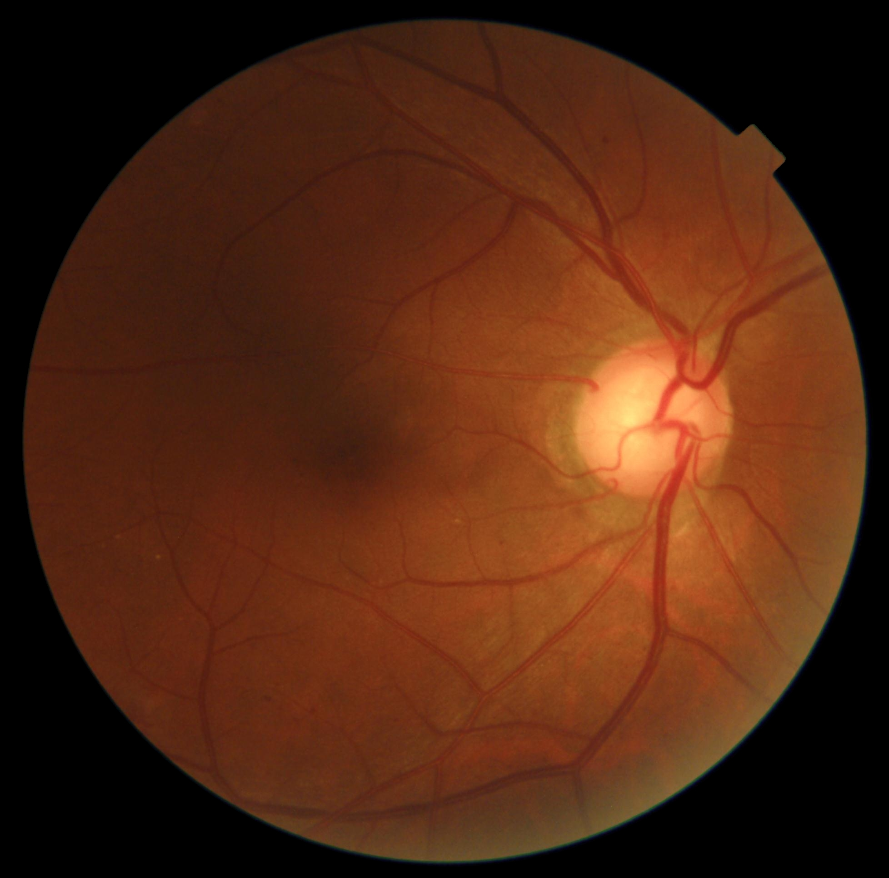
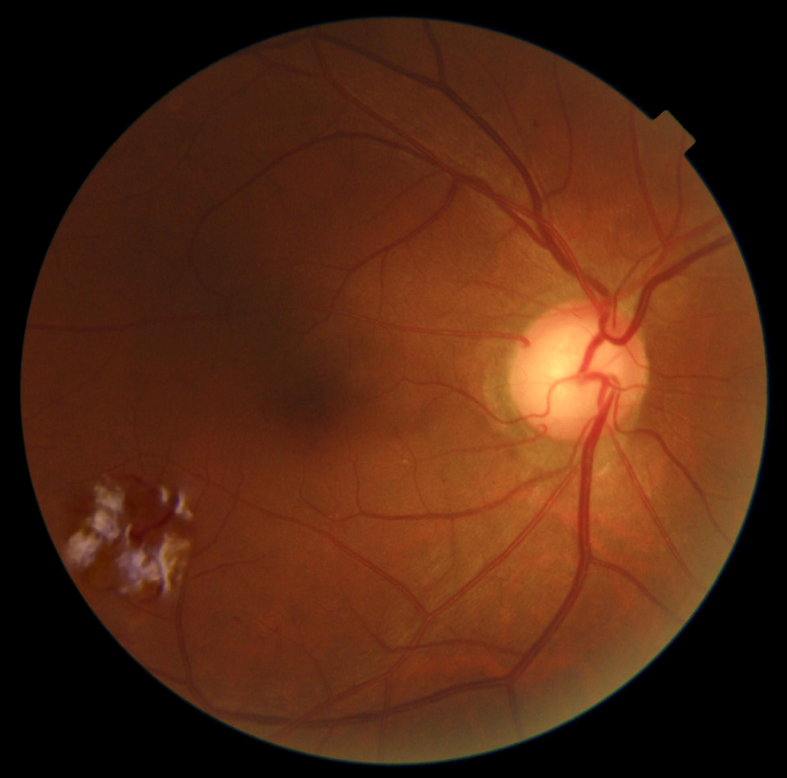
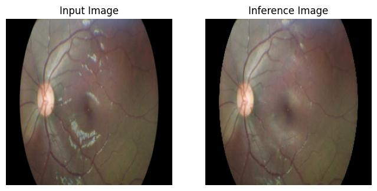

# DDR-Augmented-Artifacts

This repository provides **artifact-overlay augmented samples** of the **DDR (Diabetic Retinopathy) dataset**, along with scripts to simulate artifacts and a sample **ResU-Net** model to demonstrate artifact removal.The provided model is a small example to illustrate its use.

---

## 🔗 Original Dataset

The raw DDR dataset must be downloaded separately:
[DDR Dataset GitHub Repository](https://github.com/nkicsl/DDR-dataset)

> Paper citation: Li et al., *Information Sciences*, 2019.

After downloading DDR, you can use our augmentation scripts to generate artifact-overlaid images or use the sample augmented images provided. The sample augmented images (1,000) are available at **augmentations/output**.

---

## 🖼️ Original and Augmented Images

| Original (DDR)                | Augmented (this repo)              |
| ----------------------------- | ---------------------------------- |
|  |  |

> These images show the **original DDR images** and the **artifact-overlaid augmented images**.

---

## 🖼️ Preprocessed Output (Model Demonstration)


> Above image demonstrates the model capability to remove artifacts from the unseen image.

---

## 📂 Repository Contents

* `augmentations/` — scripts and configuration to **create artifact overlays** on DDR images
* `preprocessing/` — contains:

  * **ResU-Net model** to remove artifacts
  * **Model weights** 
  * **Training scripts** (`train.py`)
  * **Inference scripts** (`inference.py`)
  * **Example outputs** comparing input (with artifact) vs output (cleaned) images
* `CITATION.bib` — how to cite the original dataset and this augmentation work
* `LICENSE` — MIT license

---

## ⚙️ Usage

1. Download and extract the **original DDR dataset** into the `data/` folder
2. Use the augmentation scripts in `augmentations/` to generate artifact-overlaid images on your own copy of DDR
3. To remove artifacts using our sample ResU-Net model:

   * Download the model weights from [this link](https://drive.google.com/file/d/1ukObjOJXl4bBVmqzkjx3j7LEufeVS8mS/view?usp=sharing) and place them in `preprocessing/`
   * Run `preprocessing/scripts/inference.py` to generate cleaned images
   * Example outputs are saved in `preprocessing/output/`
4. Training scripts in `preprocessing/scripts/train.py` allow retraining the ResU-Net model on your own augmented dataset

> Note: The **dataset is the main focus**; the provided model is a small demo to illustrate how the dataset can be used for artifact removal.

---

## 📦 Complete Augmented Dataset

The full augmented DDR dataset can be accessed on Hugging Face:
[DDR-Augmented-Artifacts on Hugging Face](https://huggingface.co/datasets/shubham212/DR_Artifacts)

---

## 📑 Citation

Please cite **both the original DDR dataset and this augmentation work** if you use it:

```bibtex
@article{LI2019,
  title = "Diagnostic Assessment of Deep Learning Algorithms for Diabetic Retinopathy Screening",
  author = "Tao Li and Yingqi Gao and Kai Wang and Song Guo and Hanruo Liu and Hong Kang",
  journal = "Information Sciences",
  volume = "501",
  pages = "511 - 522",
  year = "2019",
  issn = "0020-0255",
  doi = "https://doi.org/10.1016/j.ins.2019.06.011",
  url = "http://www.sciencedirect.com/science/article/pii/S0020025519305377",
}

@misc{Aggarwal2025_arxiv,
  title = DDR-Augmented-Artifacts: Synthetic Artifact Overlays for Robust Diabetic Retinopathy Models,
  author = Shubham Aggarwal,
  year = 2025,
  url = https://arxiv.org/abs/XXXX.XXXXX
}
```
